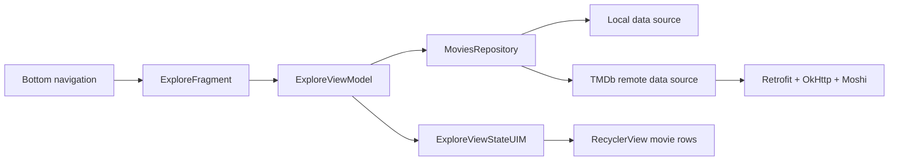

# Watch


Watch is a modular Android sample app for exploring movie discovery, app
architecture, and reusable UI pieces.

It was built as a Kotlin playground around a TMDb-powered Explore screen, an
About screen, bottom navigation, custom design components, and a layered
data/domain/presentation split. It captures a 2019 Android stack: XML views,
Data Binding, AndroidX Navigation, Koin, coroutines, Retrofit, OkHttp, Moshi,
Room-shaped data sources, and focused unit/instrumentation tests.

## Screenshots

| Explore | About |
| --- | --- |
|  |  |

## What It Demonstrates

- A multi-module Android app with separate app, presentation, domain, data,
  common, design, image loading, intents, utilities, and UI resource modules.
- A movie Explore feature with loading, content, empty, and error states.
- A repository that checks a local data source before falling back to a remote
  TMDb data source.
- ViewModels exposing UI state through `LiveData`.
- XML layouts powered by Data Binding decorators.
- Bottom navigation with AndroidX Navigation.
- Koin modules wiring feature, data, and network dependencies.
- Unit tests for mappers, repositories, ViewModels, and utilities.
- Android tests for Explore and About UI behavior.

## App Flow



## Modules

| Area | Modules | Purpose |
| --- | --- | --- |
| App shell | `app` | Main activity, bottom navigation, and app startup. |
| Presentation | `presentation:explore-view`, `presentation:about-view` | Feature UI, ViewModels, UI mappers, and screen tests. |
| Domain | `domain:movies-domain` | Movie domain models and load result states. |
| Data | `data:movies-data` | Repository, local/remote data sources, API models, and data tests. |
| Network | `common:network-common` | Retrofit, OkHttp, Moshi, caching, and TMDb query setup. |
| Design | `design:empty-view`, `design:error-view`, `design:one-line-row-view`, `ui-resources` | Reusable views, colors, dimensions, styles, and empty/error states. |
| Support | `image-loader`, `intents`, `utils`, `common:tests-common`, `common:android-tests-common` | Binding adapters, explicit intents, helpers, and shared test utilities. |

## Tech Stack

- Kotlin 1.3.41
- Android Gradle Plugin 3.5.0 RC03
- Gradle 5.6 RC2
- AndroidX, AppCompat, Fragment, Navigation, RecyclerView, ConstraintLayout
- Data Binding and XML layouts
- Koin 2.0.1
- Coroutines 1.3.0 RC2
- Retrofit 2.6.1, OkHttp 4.0.1, Moshi converter
- Room runtime API in the data layer
- Glide 4.9.0 and a small image-loader module
- JUnit 4, Mockito, Espresso, AndroidX Test

## Run It

This repo is pinned to 2019 Android tooling. For the least friction, open it
with an Android Studio/JDK setup compatible with AGP 3.5 and Gradle 5.6 RC2.

```bash
./gradlew :app:assembleLiveDebug
./gradlew :app:installLiveDebug
```

The live flavor uses a TMDb API key that is currently hardcoded in
`common/network-common`. Treat it as sample-era code, not as production secret
management.

## Test It

```bash
./gradlew testLiveDebugUnitTest
./gradlew connectedLiveDebugAndroidTest --no-parallel
```

The test suite covers repository fallback behavior, API/data mapping, Explore
state transitions, About actions, utility helpers, and instrumented UI flows.

## Status

Watch is a historical sample and personal playground, not an actively maintained
production app. Its value today is as a snapshot of modular Android architecture
patterns from the AndroidX/XML/Data Binding era.

## License

The original README declared this repository to be covered by the
[MIT license](https://en.wikipedia.org/wiki/MIT_License). A standalone
`LICENSE` file is not currently present in the repository.
